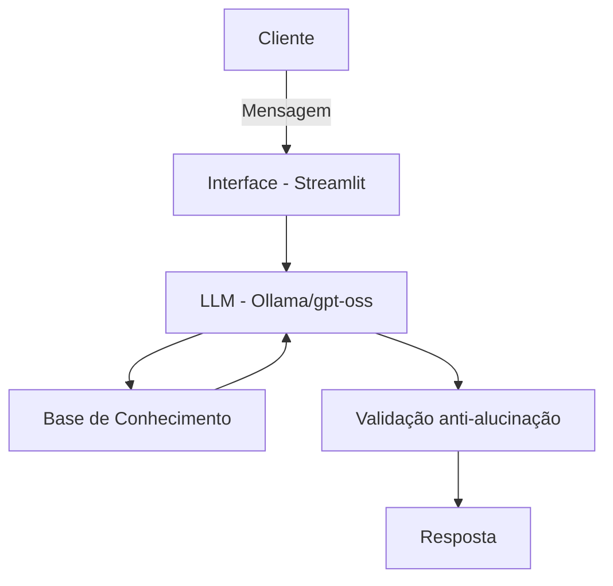

# 🎓 Finn — Educador Financeiro com IA Generativa

Finn é um agente de IA que ensina finanças pessoais de forma simples e didática, usando os dados do próprio cliente (transações, perfil de investidor e histórico de atendimento) como exemplos práticos. Projeto desenvolvido a partir do lab **"Agente Financeiro Inteligente"** da DIO.

## O que o Finn faz

- Explica conceitos financeiros (CDI, Tesouro Selic, CDB, fundos etc.) em linguagem acessível
- Analisa os gastos do cliente com base no histórico de transações
- Personaliza as explicações de acordo com o perfil de investidor (conservador, moderado, arrojado)
- **Não recomenda investimentos específicos** — apenas educa
- Admite quando não sabe algo, em vez de inventar informações

## Arquitetura



| Componente | Descrição |
|---|---|
| Interface | Chatbot em Streamlit |
| LLM | `gpt-oss` via Ollama (local) |
| Base de Conhecimento | JSON/CSV com dados mockados do cliente |
| Validação | Regras no system prompt para evitar alucinação |

## Tecnologias

- Python
- Streamlit
- Pandas
- Ollama (`gpt-oss`)

## Como rodar

```bash
# 1. Instalar o Ollama e baixar o modelo
ollama pull gpt-oss

# 2. Instalar dependências
pip install streamlit pandas requests

# 3. Subir o Ollama
ollama serve

# 4. Rodar a aplicação
streamlit run app.py
```

## Estrutura do projeto

```
├── app.py                          # Aplicação (chatbot em Streamlit)
├── data/
│   ├── transacoes.csv              # Histórico de transações do cliente
│   ├── historico_atendimento.csv   # Histórico de atendimentos anteriores
│   ├── perfil_investidor.json      # Perfil e metas do cliente
│   └── produtos_financeiros.json   # Produtos financeiros disponíveis
└── docs/
    ├── 01-documentacao-agente.md   # Caso de uso, persona e arquitetura
    ├── 02-base-conhecimento.md     # Estratégia de dados e contexto
    ├── 03-prompts.md               # System prompt e cenários de teste
    ├── 04-metricas.md              # Avaliação e métricas de qualidade
    └── 05-pitch.md                 # Roteiro do pitch
```

## Segurança e limitações

- Nunca recomenda investimentos específicos, apenas explica como funcionam
- Não responde perguntas fora do escopo de educação financeira
- Não emite opinião sobre os gastos do cliente sem base nos dados fornecidos

## Documentação completa

Veja a pasta [`docs/`](./docs) para detalhes de arquitetura, prompts, métricas de avaliação e o pitch do projeto.
