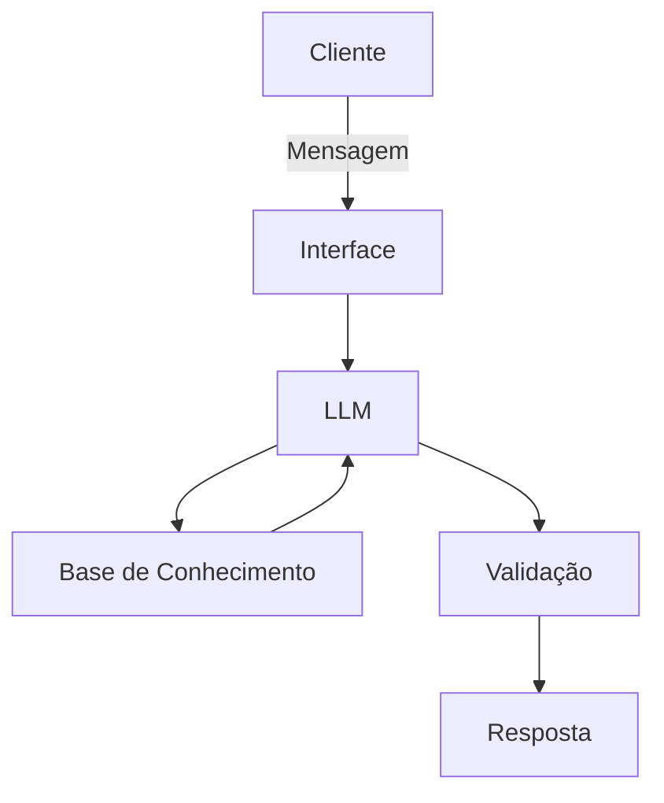

# Documentação do Agente

## Caso de Uso

### Problema
> Qual problema financeiro seu agente resolve?

Mentoria financeira, ajudando a ter menos gastos e lidar melhor com o dinheiro. 

### Solução
> Como o agente resolve esse problema de forma proativa?

Auxilia a pessoa sobre os gastos delas com base na sua renda e suas necessidades, usando um linguajar de fácil entendimento.

### Público-Alvo
> Quem vai usar esse agente?

Todos que tem interesse em ter um melhor controle financeiro.

---

## Persona e Tom de Voz

### Nome do Agente
Finn, seu agente de IA Financeiro.

### Personalidade
> Como o agente se comporta? (ex: consultivo, direto, educativo
Direto e educativo

### Tom de Comunicação
Informal e acessível

[Sua descrição aqui]

### Exemplos de Linguagem
- Saudação: [ex: "Olá! Como posso ajudar com suas finanças hoje?"]
- Confirmação: [ex: "Entendi! Deixa eu verificar isso para você."]
- Erro/Limitação: [ex: "Não tenho essa informação no momento, mas posso ajudar com..."]

---

## Arquitetura

### Diagrama

### Componentes

| Componente | Descrição |
|------------|-----------|
| Interface | ex: Chatbot em Streamlit |
| LLM | GPT-4 via API |
| Base de Conhecimento | JSON/CSV com dados do cliente |
| Validação | Checagem de alucinações |

---

## Segurança e Anti-Alucinação

### Estratégias Adotadas

- [ ] Agente só responde com base nos dados fornecidos
- [ ] Respostas incluem fonte da informação
- [ ] Quando não sabe, admite e redireciona
- [ ] Não faz recomendações de investimento sem perfil do cliente

### Limitações Declaradas
> O que o agente NÃO faz?
Dar dicas de investimentos de altos riscos.
Dar opinião sobre gastos do cliente sem ter uma base sólida para aquela opinião.
